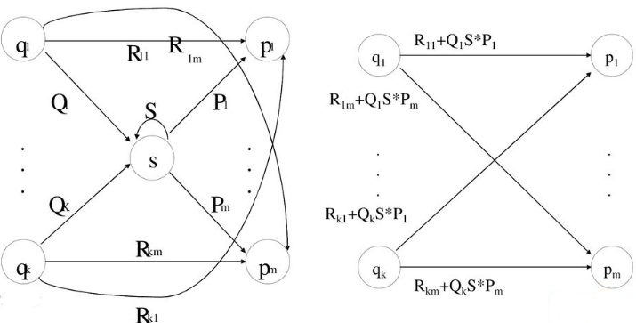
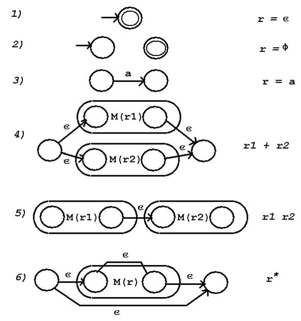

# Převod mezi regulárními výrazy a konečnými automaty  
## Uživatelská část
---  
Po načtení scriptu, jsou k dispozici čtyři predikáty:  
- automaton/4  
- regular_expression/2    
- automaton_regexp/4  
- regexp_automaton/5.  
### **`automaton(+ Slovo, + Přechodová Funkce, + Počáteční Stavy, + Koncové Stavy)`**  
Tento predikát vyhodnocuje λ-NFA, uspěje právě tehdy, když `Slovo` (reprezentované jako seznam znaků) je přijato automatem. `Přechodová funkce` je reprezentována jako seznam hran, kde hrana je seznam o tří prvcích `[stav1, znak, stav2]`, `stav1`×`znak`→`stav2`. `Počáteční stavy` a `Koncové Stavy` jsou seznamy stavů. 
Názvy stavů a znaky jsou atomy.
#### Příklad použití:
``` 
?- automaton([a], [[stav1, a, stav2]], [stav1], [stav2]).
true.
     
?- automaton([a,a], [[stav1, a, stav2]], [stav1], [stav2]). 
false.
```   
---
### **`regular_expression(+ Slovo, + Regulární výraz)`**
Tento predikát uspěje právě tehdy když `Slovo` odpovídá `Regulárnímu výrazu`. V regulárním výrazu `:` značí konkatenaci, `+` alternaci a `*` iteraci.  
#### Příklad použití:
``` 
regular_expression([a,b,b,c,a], a:((b+c)*):a).
true.
     
?- regular_expression([a,a], a:((b+c)*):a).
true.
     
?- regular_expression([a,b], a:((b+c)*):a).
false.
```  
---   
### **`automaton_regexp(+ Přechodová Funkce, + Počáteční Stavy, + Koncové Stavy, - Regulární výraz)`**
Převede automat na regulární výraz.
#### Příklad použití:
```
?- automaton_regexp([[stav1, a, stav2]], [stav1], [stav2], RegExp).
RegExp = a.

?- automaton_regexp([[stav1, a, stav2], [stav2, lambda(), stav1]], [stav1], [stav2], RegExp).
RegExp =  (a*):a.
```   
---
### **`regexp_automaton(+ Regulární výraz, - Přechodová Funkce, - Počáteční Stavy, - Koncové Stavy, + Jméno stavu)`** 
Převede regulární výraz na automat. `Jméno stavu` udává základ jména stavů, za který se bude přidávat číslo.
#### Příklad použití:
``` 
?- regexp_automaton(b+c,PF,ZS,KS,s).    
PF = [[s5, lambda(), s1], [s5, lambda(), s3], [s2, lambda(), s6], [s4, lambda(), s6], [s1, b, s2], [s3, c, s4]],
ZS = [s5],
KS = [s6].

?- regexp_automaton(a:((b+c)*),PF,ZS,KS,s).
PF = [[s2,lambda(),s9],[s1,a,s2],[s9,lambda(),s7],[s8,lambda(),s10],[s8,lambda(),s7],[s9,lambda(),s10],[s7,lambda(),s3],[s7,lambda(),s5],[s4,lambda(),s8],[s6,lambda(),s8],[s3,b,s4],[s5,c,s6]],
ZS = [s1],
KS = [s10].
``` 
---
## Programátorská část   

### **`automaton/4`**  
λ-NFA vyhodnocuji průchodem do šířky, vezmu množinu stavů, udělám lambda uzávěr a pak se zkouším posunout a jeden znak a dostanu novou množinu stavů. Po přečtení všech znaků pouze zjistím, jestli v aktuální množině stavů je nějaký koncový stav.  

---  
### **`regular_expression/2`** 
Strom regulárního výrazu procházím do hloubky a postupně matchuji slovo, pokud lze celé slovo namatchovat na celý výraz skončím.   

---  
### **`automaton_regexp/4`**  
Automat převádím na regulární výraz metodou eliminace stavů, postupně eliminuji stavy(viz obrázek) a na hranách tvořím regulární výrazy.  


Nejdříve přidám pouze jeden počáteční a koncový stav  pomocí predikátu `one_start_one_end(+StartStates, +EndStates, -StartEndEdges)` a převedu hrany na regulární výrazy predikátem `edges_regexps(+TransitionFunction, RegExpEdges)`.  
Poté začnu s eliminaci stavů `eliminate_states(+States, -RegExp)`:  
1. zvolím nekoncoví a nepočáteční stav(to je zajištěno tím že jsou označeny predikáty `start()` a `end()` a né atomy),  
2. poté vytvořím hrany vzniklé smazáním stavu `create_edges(+State, +Edges, -CreatedEdges)`, 
3. smažu všechny hrany, které obsahovaly mazaný stav `delete_state(+State, +Edges, -EdgesAfterDelete)` 
4. pomocí predikátu `edges_regexps/3` sloučím hrany.   
  
Predikát `eliminate_states/2` volám do té doby dokud mi nezbývá pouze hrana `[start(), RE, end()]`, kde `RE` je náš hledaný regulární výraz.     

---  
### **`regexp_automaton/5`**  
Stromovou strukturu výrazu postupně převádím na automat přidáváním nových stavů a hran(viz obrázek).  
  

